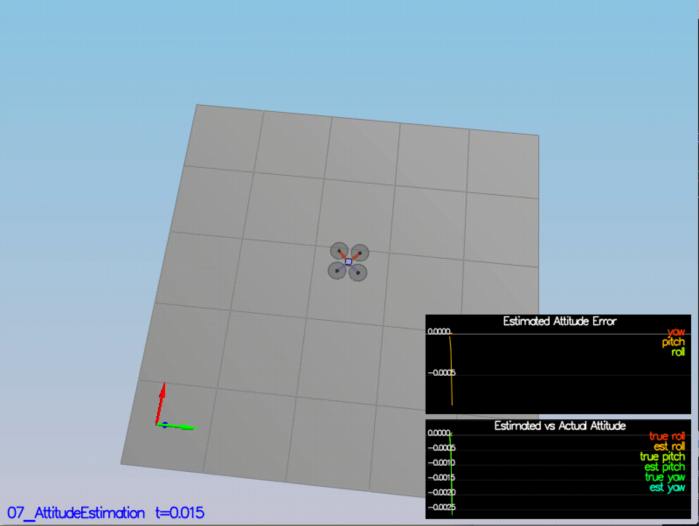
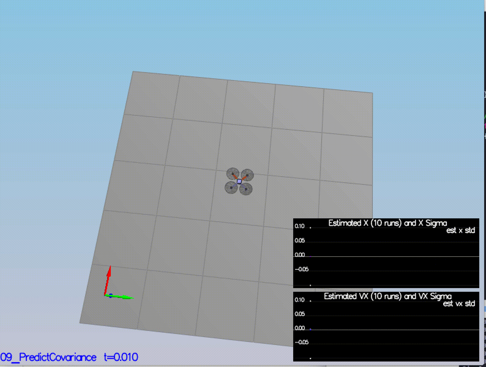

## Drone Estimation

This project follows instructions from [this](https://www.overleaf.com/read/vymfngphcccj#) paper to implement Extended Kalman Filter for Estimating Drone states.

### Step 1: Sensor Noise ###

Ran the simulator to collect sensor measurment data for GPS X data and Accelerometer X data in `config/log/Graph1.txt` and `config/log/Graph2.txt` respectively and calculated standard deviation for both:
  
  * Quad.GPS.X std:  0.727800
  * Quad.IMU.AX std: 0.510252
  
Scenario 06 simulation captures approx 68% of the respective measurements (which is what we expect within +/- 1 sigma bound for a Gaussian noise model)

<p align="center">

</p>


### Step 2: Attitude Estimation ###

`UpdateFromIMU()` contains a complementary filter-type attitude filter that uses the current attitude estimate (rollEst, pitchEst and ekfState(6)) to reduce the errors in the estimated attitude (Euler Angles). The goal is to reduce the attitude errors to get within 0.1 rad for each of the Euler angles.

```c++
  Quaternion<float> qt_attitude = Quaternion<float>::FromEuler123_RPY(rollEst,pitchEst, ekfState(6));

  Quaternion<float> qt_gyro;
  qt_gyro.IntegrateBodyRate(gyro, dtIMU);

  Quaternion<float> integration = qt_gyro * qt_attitude;
  float predictedPitch = integration.Pitch();
  float predictedRoll = integration.Roll();
  ekfState(6) = integration.Yaw();
  // normalize yaw to -pi .. pi
  if (ekfState(6) > F_PI) ekfState(6) -= 2.f*F_PI;
  if (ekfState(6) < -F_PI) ekfState(6) += 2.f*F_PI;
```
As shown below scenario `07_AttitudeEstimation`, attitude estimator sets within 0.1 rad for each of the Euler angles for at least 3 seconds.

<p align="center">

</p>

### Step 3: Prediction Step ###

Scenario `08_PredictState` uses a perfect IMU and estimator state track the actual state while Scenario `09_PredictionCov` has realistic IMU with noise. To capture growing error I calculated the partial derivative of the body-to-global rotation matrix in the function `GetRbgPrime()`.  Once you have that function implement, implement the rest of the prediction step (predict the state covariance forward) in `Predict()`.

Here is the code to predict covariance follwoing [section 7.2](https://www.overleaf.com/read/vymfngphcccj) :

```c++  
  // PrecitState() Step -------------------------------------------------------------------------
  VectorXf predictedState = curState;
  Quaternion<float> attitude = Quaternion<float>::FromEuler123_RPY(rollEst, pitchEst, curState(6));
  predictedState(0) += curState(3)*dt;
  predictedState(1) += curState(4)*dt;
  predictedState(2) += curState(5)*dt;
  V3F rot_bg = attitude.Rotate_BtoI(accel);
  predictedState(3) += rot_bg.x * dt;
  predictedState(4) += rot_bg.y * dt;
  predictedState(5) += (-9.81f + rot_bg.z) *dt;
    
  // GetRbgPrime() Step -------------------------------------------------------------------------
  MatrixXf RbgPrime(3, 3);
  RbgPrime.setZero();
  float theta = roll;
  float phi = pitch;
  float psi = yaw;
  RbgPrime(0,0) = -cos(theta)*sin(psi);
  RbgPrime(0,1) = -sin(phi)*sin(theta)*sin(psi) - cos(phi)*cos(psi);
  RbgPrime(0,2) = -cos(phi)*sin(theta)*sin(psi) + sin(phi)*cos(psi);
  RbgPrime(1,0) = cos(theta)*cos(psi);
  RbgPrime(1,1) = sin(phi)*sin(theta)*cos(psi) - cos(phi)*sin(psi);
  RbgPrime(1,2) = cos(phi)*sin(theta)*cos(psi) + sin(phi)*sin(psi);
    
  // Predict() Step -------------------------------------------------------------------------
  MatrixXf RbgPrime = GetRbgPrime(rollEst, pitchEst, ekfState(6));
  MatrixXf gPrime(QUAD_EKF_NUM_STATES, QUAD_EKF_NUM_STATES);
  gPrime.setIdentity();
  gPrime(0,3) = dt;
  gPrime(1,4) = dt;
  gPrime(2,5) = dt;
  gPrime(3,6) = (RbgPrime(0,0) * accel[0] + RbgPrime(0,1) * accel[1] + RbgPrime(0,2) * accel[2])*dt;
  gPrime(4,6) = (RbgPrime(1,0) * accel[0] + RbgPrime(1,1) * accel[1] + RbgPrime(1,2) * accel[2])*dt;
  gPrime(5,6) = (RbgPrime(2,0) * accel[0] + RbgPrime(2,1) * accel[1] + RbgPrime(2,2) * accel[2])*dt;
  ekfCov = gPrime * (ekfCov * gPrime.transpose())  + Q;
```

By tuning the `QPosXYStd` and the `QVelXYStd` process parameters in `QuadEstimatorEKF.txt` it can capture the magnitude of the error:

<p align="center">


</p>

### Step 4: Magnetometer Update ###

In this step, estimator integrates with information from the magnetometer as a part of update step to improve your filter's performance in estimating the vehicle's heading. Scenario `10_MagUpdate` uses a realistic IMU and the goal is to both have an estimated standard deviation that accurately captures the error and maintain an error of less than 0.1rad in heading for at least 10 seconds of the simulation. 

This implementations follows section [7.3.2](https://www.overleaf.com/read/vymfngphcccj) 

```c++
  // UpdateFromMag() --------------------------------------------------
  VectorXf z(1), zFromX(1);
  z(0) = magYaw;
  MatrixXf hPrime(1, QUAD_EKF_NUM_STATES);
  hPrime.setZero();
  hPrime(0,6) = 1;
  zFromX(0) = ekfState(6);
  if (z[0] - zFromX[0] > F_PI) {
      zFromX[0] += 2*F_PI;
  }
  if(z[0] - zFromX[0] < -F_PI) {
    zFromX[0] -= 2*F_PI;
  }
```
<p align="center">

</p>

### Step 5 & 6: GPS Update and Controller ###

Scenario `11_GPSUpdate` uses both an ideal estimator and and ideal IMU and the goal is to integrate GPS update into the system and complete the entire simulation cycle with estimated position error of < 1m. Controller is added to the code from the last project and retuned to keep the error <1m for the complete simulation process.

Here is the GPS update implementations following section [7.3.2](https://www.overleaf.com/read/vymfngphcccj) 

```c++
  // UpdateFromMag() --------------------------------------------------
  VectorXf z(1), zFromX(1);
  z(0) = magYaw;
  MatrixXf hPrime(1, QUAD_EKF_NUM_STATES);
  hPrime.setZero();
  hPrime(0,6) = 1;
  zFromX(0) = ekfState(6);
  if (z[0] - zFromX[0] > F_PI) {
      zFromX[0] += 2*F_PI;
  }
  if(z[0] - zFromX[0] < -F_PI) {
    zFromX[0] -= 2*F_PI;
  }
```
<p align="center">

</p>
