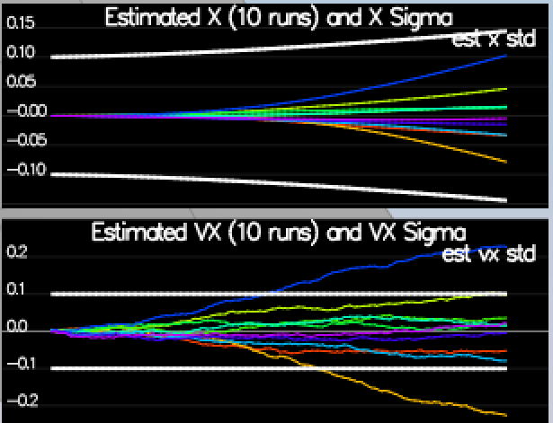

## Drone Estimation

This project follows instructions from [this](https://www.overleaf.com/read/vymfngphcccj#/54894644/) paper to implement Extended Kalman Filter for Estimating Drone states.

### Step 1: Sensor Noise ###

Ran the simulator to collect sensor measurment data for GPS X data and Accelerometer X data in `config/log/Graph1.txt` and `config/log/Graph2.txt` respectively and calculated standard deviation for both:
  
  * Quad.GPS.X std:  0.727800
  * Quad.IMU.AX std: 0.510252
  
Scenario 06 simulation captures approx 68% of the respective measurements (which is what we expect within +/- 1 sigma bound for a Gaussian noise model)

IMAGE ******


### Step 2: Attitude Estimation ###

`UpdateFromIMU()` contains a complementary filter-type attitude filter that uses the current attitude estimate (rollEst, pitchEst and ekfState(6)) to reduce the errors in the estimated attitude (Euler Angles). The goal is to reduce the attitude errors to get within 0.1 rad for each of the Euler angles.

```c++
  Quaternion<float> qt_attitude = Quaternion<float>::FromEuler123_RPY(rollEst,pitchEst, ekfState(6));

  Quaternion<float> qt_gyro;
  qt_gyro.IntegrateBodyRate(gyro, dtIMU);

  Quaternion<float> integration = qt_gyro * qt_attitude;
  float predictedPitch = integration.Pitch();
  float predictedRoll = integration.Roll();
  ekfState(6) = integration.Yaw();
  // normalize yaw to -pi .. pi
  if (ekfState(6) > F_PI) ekfState(6) -= 2.f*F_PI;
  if (ekfState(6) < -F_PI) ekfState(6) += 2.f*F_PI;
```
As shown below scenario `07_AttitudeEstimation`, attitude estimator sets within 0.1 rad for each of the Euler angles for at least 3 seconds.

IMAGE*********

### Step 3: Prediction Step ###

In this next step you will be implementing the prediction step of your filter.


Scenario `08_PredictState` uses a perfect IMU and estimator state track the actual state while Scenario `09_PredictionCov` has realistic IMU with noise. To capture growing error I calculated the partial derivative of the body-to-global rotation matrix in the function `GetRbgPrime()`.  Once you have that function implement, implement the rest of the prediction step (predict the state covariance forward) in `Predict()`.

Here is the code to predict covariance covariance:

```c++  
  // PrecitState() Step -------------------------------------------------------------------------
  VectorXf predictedState = curState;
  Quaternion<float> attitude = Quaternion<float>::FromEuler123_RPY(rollEst, pitchEst, curState(6));
  predictedState(0) += curState(3)*dt;
  predictedState(1) += curState(4)*dt;
  predictedState(2) += curState(5)*dt;
  V3F rot_bg = attitude.Rotate_BtoI(accel);
  predictedState(3) += rot_bg.x * dt;
  predictedState(4) += rot_bg.y * dt;
  predictedState(5) += (-9.81f + rot_bg.z) *dt;
    
  // GetRbgPrime() Step -------------------------------------------------------------------------
  MatrixXf RbgPrime(3, 3);
  RbgPrime.setZero();
  float theta = roll;
  float phi = pitch;
  float psi = yaw;
  RbgPrime(0,0) = -cos(theta)*sin(psi);
  RbgPrime(0,1) = -sin(phi)*sin(theta)*sin(psi) - cos(phi)*cos(psi);
  RbgPrime(0,2) = -cos(phi)*sin(theta)*sin(psi) + sin(phi)*cos(psi);
  RbgPrime(1,0) = cos(theta)*cos(psi);
  RbgPrime(1,1) = sin(phi)*sin(theta)*cos(psi) - cos(phi)*sin(psi);
  RbgPrime(1,2) = cos(phi)*sin(theta)*cos(psi) + sin(phi)*sin(psi);

  RbgPrime(2,0) = 0.f;
  RbgPrime(2,1) = 0.f;
  RbgPrime(2,2) = 0.f;
    
  // Predict() Step -------------------------------------------------------------------------
  MatrixXf RbgPrime = GetRbgPrime(rollEst, pitchEst, ekfState(6));
  MatrixXf gPrime(QUAD_EKF_NUM_STATES, QUAD_EKF_NUM_STATES);
  gPrime.setIdentity();
  gPrime(0,3) = dt;
  gPrime(1,4) = dt;
  gPrime(2,5) = dt;
  gPrime(3,6) = (RbgPrime(0,0) * accel[0] + RbgPrime(0,1) * accel[1] + RbgPrime(0,2) * accel[2])*dt;
  gPrime(4,6) = (RbgPrime(1,0) * accel[0] + RbgPrime(1,1) * accel[1] + RbgPrime(1,2) * accel[2])*dt;
  gPrime(5,6) = (RbgPrime(2,0) * accel[0] + RbgPrime(2,1) * accel[1] + RbgPrime(2,2) * accel[2])*dt;
  ekfCov = gPrime * (ekfCov * gPrime.transpose())  + Q;
```

and tune the `QPosXYStd` and the `QVelXYStd` process parameters in `QuadEstimatorEKF.txt` to try to capture the magnitude of the error you see. Note that as error grows our simplified model will not capture the real error dynamics (for example, specifically, coming from attitude errors), therefore  try to make it look reasonable only for a relatively short prediction period (the scenario is set for one second).  A good solution looks as follows:


Looking at this result, you can see that in the first part of the plot, our covariance (the white line) grows very much like the data.

If we look at an example with a `QPosXYStd` that is much too high (shown below), we can see that the covariance no longer grows in the same way as the data.


Another set of bad examples is shown below for having a `QVelXYStd` too large (first) and too small (second).  As you can see, once again, our covariances in these cases no longer model the data well.




***Success criteria:*** *This step doesn't have any specific measurable criteria being checked.*


### Step 4: Magnetometer Update ###

Up until now we've only used the accelerometer and gyro for our state estimation.  In this step, you will be adding the information from the magnetometer to improve your filter's performance in estimating the vehicle's heading.

1. Run scenario `10_MagUpdate`.  This scenario uses a realistic IMU, but the magnetometer update hasn’t been implemented yet. As a result, you will notice that the estimate yaw is drifting away from the real value (and the estimated standard deviation is also increasing).  Note that in this case the plot is showing you the estimated yaw error (`quad.est.e.yaw`), which is drifting away from zero as the simulation runs.  You should also see the estimated standard deviation of that state (white boundary) is also increasing.

2. Tune the parameter `QYawStd` (`QuadEstimatorEKF.txt`) for the QuadEstimatorEKF so that it approximately captures the magnitude of the drift, as demonstrated here:


3. Implement magnetometer update in the function `UpdateFromMag()`.  Once completed, you should see a resulting plot similar to this one:


***Success criteria:*** *Your goal is to both have an estimated standard deviation that accurately captures the error and maintain an error of less than 0.1rad in heading for at least 10 seconds of the simulation.*

**Hint: after implementing the magnetometer update, you may have to once again tune the parameter `QYawStd` to better balance between the long term drift and short-time noise from the magnetometer.**

**Hint: see section 7.3.2 of [Estimation for Quadrotors](https://www.overleaf.com/read/vymfngphcccj) for a refresher on the magnetometer update.**


### Step 5: Closed Loop + GPS Update ###

1. Run scenario `11_GPSUpdate`.  At the moment this scenario is using both an ideal estimator and and ideal IMU.  Even with these ideal elements, watch the position and velocity errors (bottom right). As you see they are drifting away, since GPS update is not yet implemented.

2. Let's change to using your estimator by setting `Quad.UseIdealEstimator` to 0 in `config/11_GPSUpdate.txt`.  Rerun the scenario to get an idea of how well your estimator work with an ideal IMU.

3. Now repeat with realistic IMU by commenting out these lines in `config/11_GPSUpdate.txt`:
```
#SimIMU.AccelStd = 0,0,0
#SimIMU.GyroStd = 0,0,0
```

4. Tune the process noise model in `QuadEstimatorEKF.txt` to try to approximately capture the error you see with the estimated uncertainty (standard deviation) of the filter.

5. Implement the EKF GPS Update in the function `UpdateFromGPS()`.

6. Now once again re-run the simulation.  Your objective is to complete the entire simulation cycle with estimated position error of < 1m (you’ll see a green box over the bottom graph if you succeed).  You may want to try experimenting with the GPS update parameters to try and get better performance.

***Success criteria:*** *Your objective is to complete the entire simulation cycle with estimated position error of < 1m.*

**Hint: see section 7.3.1 of [Estimation for Quadrotors](https://www.overleaf.com/read/vymfngphcccj) for a refresher on the GPS update.**

At this point, congratulations on having a working estimator!

### Step 6: Adding Your Controller ###

Up to this point, we have been working with a controller that has been relaxed to work with an estimated state instead of a real state.  So now, you will see how well your controller performs and de-tune your controller accordingly.

1. Replace `QuadController.cpp` with the controller you wrote in the last project.

2. Replace `QuadControlParams.txt` with the control parameters you came up with in the last project.

3. Run scenario `11_GPSUpdate`. If your controller crashes immediately do not panic. Flying from an estimated state (even with ideal sensors) is very different from flying with ideal pose. You may need to de-tune your controller. Decrease the position and velocity gains (we’ve seen about 30% detuning being effective) to stabilize it.  Your goal is to once again complete the entire simulation cycle with an estimated position error of < 1m.

**Hint: you may find it easiest to do your de-tuning as a 2 step process by reverting to ideal sensors and de-tuning under those conditions first.**

***Success criteria:*** *Your objective is to complete the entire simulation cycle with estimated position error of < 1m.*


## Tips and Tricks ##

 - When it comes to transposing matrices, `.transposeInPlace()` is the function you want to use to transpose a matrix

 - The [Estimation for Quadrotors](https://www.overleaf.com/read/vymfngphcccj) document contains a helpful mathematical breakdown of the core elements on your estimator

## Submission ##

For this project, you will need to submit:

 - a completed estimator that meets the performance criteria for each of the steps by submitting:
   - `QuadEstimatorEKF.cpp`
   - `config/QuadEstimatorEKF.txt`

 - a re-tuned controller that, in conjunction with your tuned estimator, is capable of meeting the criteria laid out in Step 6 by submitting:
   - `QuadController.cpp`
   - `config/QuadControlParams.txt`

 - a write up addressing all the points of the rubric

## Authors ##

Thanks to Fotokite for the initial development of the project code and simulator.
